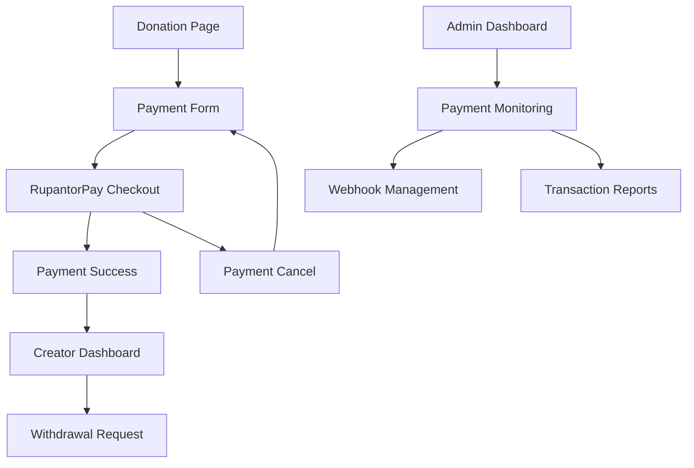

# RupantorPay Payment Gateway Integration - Product Requirements Document

## 1. Product Overview

Integrate RupantorPay payment gateway into the TipKoro donation platform to enable secure, real-time payment processing for creator tips and donations. This integration will replace the current demo payment system with a fully functional payment gateway supporting bKash, Nagad, and bank card payments in Bangladesh.

The integration addresses the critical need for actual payment processing in the TipKoro platform, enabling creators to receive real donations and supporters to make secure payments through trusted local payment methods.

## 2. Core Features

### 2.1 User Roles

| Role            | Registration Method               | Core Permissions                                                   |
| --------------- | --------------------------------- | ------------------------------------------------------------------ |
| Donor/Supporter | No registration required          | Can make donations, view payment status                            |
| Creator         | Email registration + subscription | Can receive donations, view payment history, withdraw funds        |
| Admin           | System invitation                 | Can monitor all payments, handle disputes, manage gateway settings |

### 2.2 Feature Module

Our RupantorPay integration consists of the following main components:

1. **Payment Processing Page**: Enhanced donation form with RupantorPay integration, payment method selection, secure checkout flow.
2. **Payment Success Page**: Transaction verification, payment confirmation display, receipt generation.
3. **Payment Cancel Page**: Cancellation handling, return to donation flow, error messaging.
4. **Admin Payment Dashboard**: Payment monitoring, transaction logs, webhook status tracking.
5. **Creator Payment History**: Donation tracking, payment status updates, earnings overview.

### 2.3 Page Details

| Page Name          | Module Name                 | Feature description                                                                                                                      |
| ------------------ | --------------------------- | ---------------------------------------------------------------------------------------------------------------------------------------- |
| Payment Processing | Enhanced Donation Form      | Replace demo payment with RupantorPay checkout, validate donation amounts (min ৳10), collect donor information, generate transaction IDs |
| Payment Processing | Payment Gateway Integration | Call RupantorPay API, redirect to payment URL, handle payment method selection (bKash/Nagad/Cards)                                       |
| Payment Success    | Transaction Verification    | Verify payment status via RupantorPay API, update database records, display confirmation message with transaction details                |
| Payment Success    | Receipt Generation          | Generate payment receipt, send confirmation email, update creator earnings                                                               |
| Payment Cancel     | Cancellation Handling       | Handle payment cancellations, preserve donation form data, provide retry options                                                         |
| Admin Dashboard    | Payment Monitoring          | Display all transactions, filter by status/date/creator, export payment reports                                                          |
| Admin Dashboard    | Webhook Management          | Monitor webhook deliveries, retry failed webhooks, view response times                                                                   |
| Creator Dashboard  | Payment History             | Show received donations, payment statuses, earnings summary, withdrawal options                                                          |
| Database Schema    | Payment Tables              | Create payments and orders tables, establish relationships, implement indexes                                                            |
| API Endpoints      | Payment APIs                | Implement initiation, webhook, and verification endpoints with proper security                                                           |

## 3. Core Process

### Donation Payment Flow

1. Supporter visits creator's donation page
2. Enters donation amount (minimum ৳10) and optional message
3. Provides donor information (name, email) or chooses anonymous
4. Clicks "Pay via RupantorPay" button
5. System creates order and payment records in database
6. System calls RupantorPay API to generate payment URL
7. User redirects to RupantorPay payment page
8. User completes payment using bKash/Nagad/Card
9. RupantorPay sends webhook notification to system
10. System verifies payment and updates database
11. User redirects to success page with confirmation
12. Creator receives notification of new donation

### Admin Monitoring Flow

1. Admin accesses payment dashboard
2. Views real-time payment statistics
3. Monitors webhook delivery status
4. Handles failed payments or disputes
5. Generates payment reports for analysis

## 4. User Interface Design

### 4.1 Design Style

* **Primary Colors**: Orange gradient (#FF6B35 to #FF8E53) for payment buttons, green (#10B981) for success states

* **Secondary Colors**: Gray (#6B7280) for text, red (#EF4444) for errors, blue (#3B82F6) for information

* **Button Style**: Rounded corners (8px), gradient backgrounds for primary actions, subtle shadows

* **Font**: Inter font family, 16px base size, 18px for payment amounts, 14px for helper text

* **Layout Style**: Card-based design with subtle borders, centered payment forms, responsive grid layouts

* **Icons**: Lucide React icons for payment methods, status indicators, and navigation elements

### 4.2 Page Design Overview

| Page Name          | Module Name          | UI Elements                                                                                                               |
| ------------------ | -------------------- | ------------------------------------------------------------------------------------------------------------------------- |
| Payment Processing | Enhanced Form        | Orange gradient payment button, payment method icons (bKash/Nagad/Card), amount input with ৳ symbol, anonymous checkbox   |
| Payment Success    | Confirmation Display | Green checkmark icon, transaction ID display, payment amount in large text, creator profile card, receipt download button |
| Payment Cancel     | Error Handling       | Orange warning icon, cancellation message, "Try Again" button, return to donation link                                    |
| Admin Dashboard    | Monitoring Interface | Data tables with sorting, status badges (pending/completed/failed), search filters, export buttons                        |
| Creator Dashboard  | Payment History      | Timeline view of donations, earnings chart, payment status indicators, withdrawal button                                  |

### 4.3 Responsiveness

Mobile-first responsive design with touch-optimized payment buttons, collapsible forms on small screens, and adaptive layouts for tablet and desktop viewing. Payment flow optimized for mobile users as primary audience for donation platforms.

## 5. Technical Requirements

### 5.1 Database Schema Updates

**New Tables Required:**

* `payments` table for transaction tracking

* `orders` table for order management

* Indexes on transaction\_id, user\_id, and created\_at fields

* Foreign key relationships with existing donations table

### 5.2 API Endpoints

**Required Endpoints:**

* `POST /api/rupantorpay/initiate` - Payment initiation

* `POST /api/rupantorpay/webhook` - Webhook handler

* `POST /api/rupantorpay/verify` - Payment verification

* `GET /api/payments/history` - Payment history for creators

* `GET /api/admin/payments` - Admin payment monitoring

### 5.3 Environment Configuration

**Required Environment Variables:**

* `RUPANTORPAY_API_KEY` - Gateway API key

* `RUPANTORPAY_CHECKOUT_URL` - Payment initiation endpoint

* `RUPANTORPAY_VERIFY_URL` - Payment verification endpoint

* `SITE_URL` - Base URL for success/cancel redirects

### 5.4 Security Requirements

* Server-side payment verification only

* HTTPS enforcement for all payment endpoints

* Webhook signature validation

* Transaction logging and audit trails

* Duplicate payment prevention

* Input validation and sanitization

## 6. Success Metrics

### 6.1 Primary Metrics

* Payment success rate > 95%

* Average payment processing time < 30 seconds

* Webhook delivery success rate > 99%

* Zero payment security incidents

### 6.2 User Experience Metrics

* Donation completion rate improvement

* Reduced payment abandonment

* Creator satisfaction with payment reliability

* Supporter trust in payment security

## 7. Implementation Priority

### Phase 1 (Critical)

1. Database schema updates
2. Payment initiation API
3. Basic webhook handling
4. Frontend payment integration

### Phase 2 (Important)

1. Payment verification endpoint
2. Success/cancel pages
3. Admin monitoring dashboard
4. Error handling and logging

### Phase 3 (Enhancement)

1. Advanced reporting features
2. Payment analytics
3. Automated reconciliation
4. Performance optimizations

