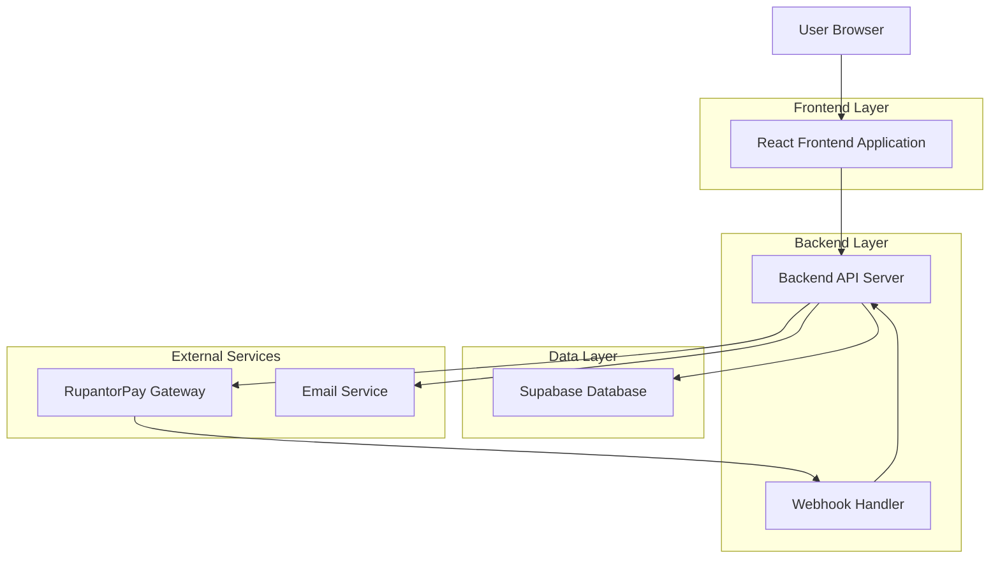
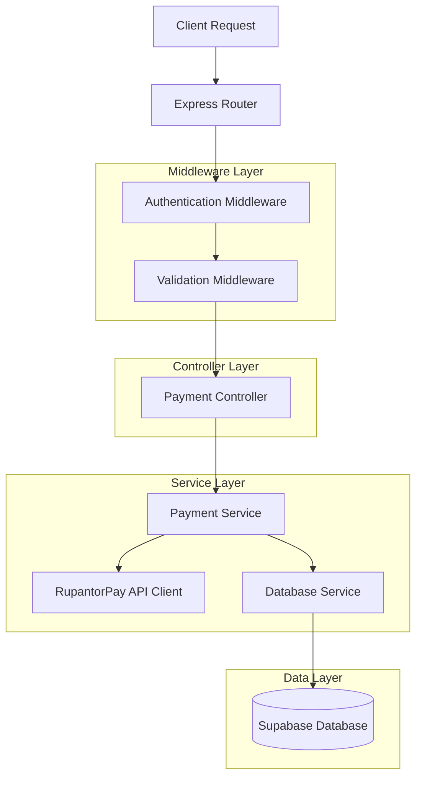
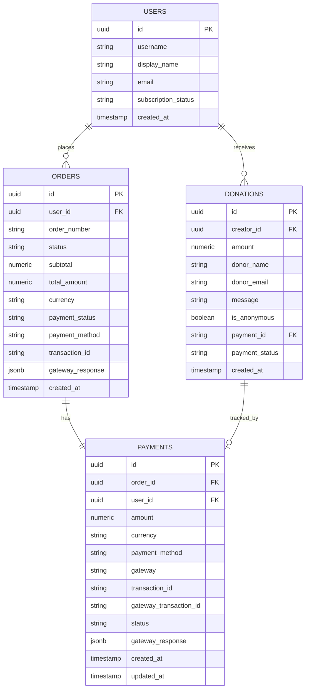

# RupantorPay Integration - Technical Architecture Document

## 1. Architecture Design



## 2. Technology Description

* Frontend: React\@18 + TypeScript + TailwindCSS + Vite

* Backend: Node.js/Express API server (new requirement for payment processing)

* Database: Supabase (PostgreSQL)

* Payment Gateway: RupantorPay API

* Authentication: Supabase Auth

* Email: Supabase Edge Functions or external service

## 3. Route Definitions

| Route               | Purpose                                             |
| ------------------- | --------------------------------------------------- |
| `/donate/:username` | Enhanced donation page with RupantorPay integration |
| `/payment-success`  | Payment confirmation and verification page          |
| `/payment-cancel`   | Payment cancellation handling page                  |
| `/creator/payments` | Creator payment history and earnings dashboard      |
| `/admin/payments`   | Admin payment monitoring and management             |

## 4. API Definitions

### 4.1 Core Payment APIs

**Payment Initiation**

```
POST /api/rupantorpay/initiate
```

Request:

| Param Name      | Param Type    | isRequired | Description                           |
| --------------- | ------------- | ---------- | ------------------------------------- |
| donationId      | string (UUID) | true       | ID of the donation record             |
| amount          | number        | true       | Donation amount in BDT (minimum 10)   |
| donorInfo       | object        | true       | Donor information object              |
| donorInfo.name  | string        | false      | Donor's full name (null if anonymous) |
| donorInfo.email | string        | false      | Donor's email address                 |
| creatorId       | string (UUID) | true       | ID of the creator receiving donation  |

Response:

| Param Name    | Param Type | Description              |
| ------------- | ---------- | ------------------------ |
| success       | boolean    | Operation success status |
| paymentUrl    | string     | RupantorPay checkout URL |
| transactionId | string     | Generated transaction ID |
| message       | string     | Response message         |

Example Request:

```json
{
  "donationId": "123e4567-e89b-12d3-a456-426614174000",
  "amount": 500,
  "donorInfo": {
    "name": "John Doe",
    "email": "john@example.com"
  },
  "creatorId": "987fcdeb-51a2-43d1-b123-456789abcdef"
}
```

**Webhook Handler**

```
POST /api/rupantorpay/webhook
```

Request (from RupantorPay):

| Param Name      | Param Type | isRequired | Description                            |
| --------------- | ---------- | ---------- | -------------------------------------- |
| transaction\_id | string     | true       | Transaction ID from payment initiation |
| status          | string     | true       | Payment status (completed/failed)      |
| amount          | string     | true       | Payment amount                         |

Response:

| Param Name | Param Type | Description               |
| ---------- | ---------- | ------------------------- |
| success    | boolean    | Webhook processing status |
| message    | string     | Processing result message |

**Payment Verification**

```
POST /api/rupantorpay/verify
```

Request:

| Param Name      | Param Type | isRequired | Description              |
| --------------- | ---------- | ---------- | ------------------------ |
| transaction\_id | string     | true       | Transaction ID to verify |

Response:

| Param Name      | Param Type | Description                 |
| --------------- | ---------- | --------------------------- |
| success         | boolean    | Verification success status |
| payment\_status | string     | Verified payment status     |
| amount          | number     | Verified payment amount     |
| donation        | object     | Associated donation details |

### 4.2 Creator Payment APIs

**Payment History**

```
GET /api/creator/payments
```

Query Parameters:

| Param Name | Param Type | isRequired | Description                    |
| ---------- | ---------- | ---------- | ------------------------------ |
| page       | number     | false      | Page number (default: 1)       |
| limit      | number     | false      | Items per page (default: 20)   |
| status     | string     | false      | Filter by payment status       |
| from\_date | string     | false      | Start date filter (ISO format) |
| to\_date   | string     | false      | End date filter (ISO format)   |

Response:

| Param Name  | Param Type | Description              |
| ----------- | ---------- | ------------------------ |
| payments    | array      | Array of payment objects |
| total       | number     | Total payment count      |
| totalAmount | number     | Total earnings amount    |
| pagination  | object     | Pagination metadata      |

### 4.3 Admin APIs

**Payment Monitoring**

```
GET /api/admin/payments
```

Query Parameters:

| Param Name  | Param Type | isRequired | Description                            |
| ----------- | ---------- | ---------- | -------------------------------------- |
| page        | number     | false      | Page number                            |
| limit       | number     | false      | Items per page                         |
| status      | string     | false      | Payment status filter                  |
| creator\_id | string     | false      | Filter by creator                      |
| search      | string     | false      | Search by transaction ID or donor name |

Response:

| Param Name | Param Type | Description              |
| ---------- | ---------- | ------------------------ |
| payments   | array      | Array of payment records |
| stats      | object     | Payment statistics       |
| total      | number     | Total record count       |

## 5. Server Architecture Diagram



## 6. Data Model

### 6.1 Data Model Definition



### 6.2 Data Definition Language

**Orders Table**

```sql
-- Create orders table
CREATE TABLE orders (
    id UUID PRIMARY KEY DEFAULT gen_random_uuid(),
    user_id UUID REFERENCES users(id),
    order_number TEXT NOT NULL UNIQUE,
    status TEXT DEFAULT 'pending' CHECK (status IN ('pending', 'processing', 'completed', 'cancelled')),
    subtotal NUMERIC NOT NULL CHECK (subtotal >= 0),
    tax_amount NUMERIC DEFAULT 0 CHECK (tax_amount >= 0),
    shipping_amount NUMERIC DEFAULT 0 CHECK (shipping_amount >= 0),
    discount_amount NUMERIC DEFAULT 0 CHECK (discount_amount >= 0),
    total_amount NUMERIC NOT NULL CHECK (total_amount >= 0),
    currency TEXT DEFAULT 'BDT',
    payment_status TEXT DEFAULT 'pending' CHECK (payment_status IN ('pending', 'paid', 'failed', 'refunded')),
    payment_method TEXT DEFAULT 'rupantorpay',
    transaction_id TEXT,
    gateway_response JSONB,
    billing_address JSONB,
    shipping_address JSONB,
    coupon_code TEXT,
    created_at TIMESTAMP WITH TIME ZONE DEFAULT NOW(),
    updated_at TIMESTAMP WITH TIME ZONE DEFAULT NOW()
);

-- Create indexes
CREATE INDEX idx_orders_user_id ON orders(user_id);
CREATE INDEX idx_orders_status ON orders(status);
CREATE INDEX idx_orders_payment_status ON orders(payment_status);
CREATE INDEX idx_orders_transaction_id ON orders(transaction_id);
CREATE INDEX idx_orders_created_at ON orders(created_at DESC);
```

**Payments Table**

```sql
-- Create payments table
CREATE TABLE payments (
    id UUID PRIMARY KEY DEFAULT gen_random_uuid(),
    order_id UUID NOT NULL REFERENCES orders(id) ON DELETE CASCADE,
    user_id UUID NOT NULL REFERENCES users(id),
    amount NUMERIC NOT NULL CHECK (amount > 0),
    currency TEXT DEFAULT 'BDT',
    payment_method TEXT NOT NULL,
    gateway TEXT DEFAULT 'rupantorpay',
    transaction_id TEXT UNIQUE,
    gateway_transaction_id TEXT,
    status TEXT DEFAULT 'pending' CHECK (status IN ('pending', 'processing', 'completed', 'failed', 'cancelled', 'refunded')),
    gateway_response JSONB,
    created_at TIMESTAMP WITH TIME ZONE DEFAULT NOW(),
    updated_at TIMESTAMP WITH TIME ZONE DEFAULT NOW()
);

-- Create indexes
CREATE INDEX idx_payments_order_id ON payments(order_id);
CREATE INDEX idx_payments_user_id ON payments(user_id);
CREATE INDEX idx_payments_transaction_id ON payments(transaction_id);
CREATE INDEX idx_payments_gateway_transaction_id ON payments(gateway_transaction_id);
CREATE INDEX idx_payments_status ON payments(status);
CREATE INDEX idx_payments_created_at ON payments(created_at DESC);
```

**Update Donations Table**

```sql
-- Add foreign key reference to payments table
ALTER TABLE donations 
ADD CONSTRAINT fk_donations_payment_id 
FOREIGN KEY (payment_id) REFERENCES payments(id);

-- Create index for payment_id
CREATE INDEX idx_donations_payment_id ON donations(payment_id);
```

**Row Level Security (RLS) Policies**

```sql
-- Enable RLS
ALTER TABLE orders ENABLE ROW LEVEL SECURITY;
ALTER TABLE payments ENABLE ROW LEVEL SECURITY;

-- Orders policies
CREATE POLICY "Users can view their own orders" ON orders
    FOR SELECT USING (auth.uid() = user_id);

CREATE POLICY "Users can create their own orders" ON orders
    FOR INSERT WITH CHECK (auth.uid() = user_id);

CREATE POLICY "Users can update their own orders" ON orders
    FOR UPDATE USING (auth.uid() = user_id);

-- Payments policies
CREATE POLICY "Users can view their own payments" ON payments
    FOR SELECT USING (auth.uid() = user_id);

CREATE POLICY "System can manage all payments" ON payments
    FOR ALL USING (auth.role() = 'service_role');

-- Grant permissions
GRANT SELECT ON orders TO anon;
GRANT ALL PRIVILEGES ON orders TO authenticated;
GRANT SELECT ON payments TO anon;
GRANT ALL PRIVILEGES ON payments TO authenticated;
```

**Initial Data**

```sql
-- Insert sample order statuses for reference
INSERT INTO orders (user_id, order_number, subtotal, total_amount, status, payment_status)
SELECT 
    id,
    'ORD-' || EXTRACT(EPOCH FROM NOW())::bigint || '-' || SUBSTRING(id::text, 1, 8),
    100,
    100,
    'pending',
    'pending'
FROM users 
WHERE subscription_status = 'active'
LIMIT 1;
```

## 7. Environment Configuration

**Required Environment Variables:**

```env
# RupantorPay Configuration
RUPANTORPAY_API_KEY=ecKCnXFx87Hp6qbZQuwrSJcBwj7rvTR5Cjb9TSwR5nohJ662Qu
RUPANTORPAY_CHECKOUT_URL=https://payment.rupantorpay.com/api/payment/checkout
RUPANTORPAY_VERIFY_URL=https://payment.rupantorpay.com/api/payment/verify-payment

# Application Configuration
SITE_URL=https://tipkoro.com
API_BASE_URL=https://api.tipkoro.com

# Database Configuration
SUPABASE_URL=your_supabase_url
SUPABASE_ANON_KEY=your_supabase_anon_key
SUPABASE_SERVICE_ROLE_KEY=your_supabase_service_role_key

# Security
JWT_SECRET=your_jwt_secret
WEBHOOK_SECRET=your_webhook_secret

# Logging
LOG_LEVEL=info
LOG_FILE_PATH=./logs/payments.log
```

## 8. Security Implementation

### 8.1 Authentication & Authorization

* JWT-based authentication for API endpoints

* Role-based access control (donor, creator, admin)

* Supabase RLS policies for data access

* API key validation for webhook endpoints

### 8.2 Payment Security

* Server-side payment verification only

* Webhook signature validation

* Transaction ID uniqueness enforcement

* Amount validation and sanitization

* Duplicate payment prevention

### 8.3 Data Protection

* HTTPS enforcement for all endpoints

* Sensitive data encryption at rest

* PCI DSS compliance considerations

* Audit logging for all payment operations

* Input validation and SQL injection prevention

## 9. Performance Considerations

### 9.1 Database Optimization

* Proper indexing on frequently queried fields

* Connection pooling for database connections

* Query optimization for payment history

* Pagination for large result sets

### 9.2 API Performance

* Response caching for static data

* Rate limiting for payment endpoints

* Async processing for webhook handling

* Connection timeout configuration

### 9.3 Monitoring

* Payment success/failure rate tracking

* Webhook delivery monitoring

* API response time metrics

* Database query performance monitoring

